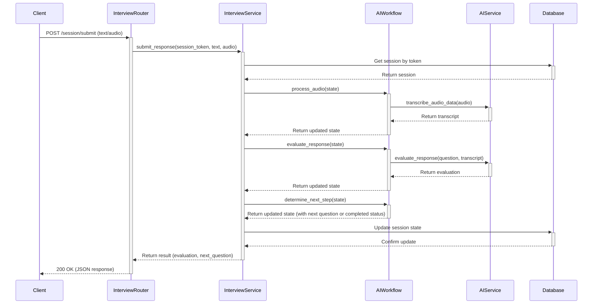
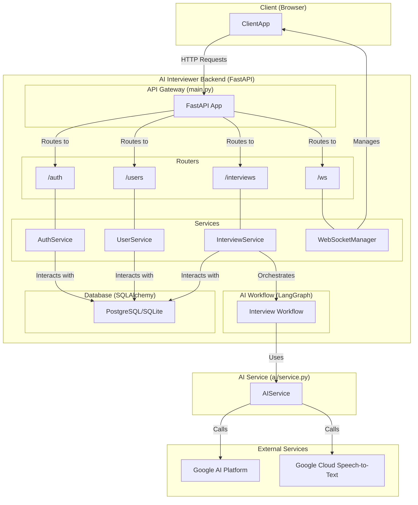

# AI Interviewer Backend Documentation

This document provides a detailed overview of the AI Interviewer backend system, including its architecture, key components, and request flows.

## 1. High-Level Overview

The backend is a FastAPI application designed to conduct AI-powered interviews. It manages user authentication, interview creation, and the interactive interview process, which is powered by a LangGraph state machine. The system is designed to handle both text and audio responses, evaluate them in real-time, and provide feedback and follow-up questions.

The application is divided into several key modules:

- **`main`**: The FastAPI application entry point.
- **`config`**: Centralized application configuration.
- **`auth`**: Handles user registration, login, and authentication.
- **`users`**: Manages user profiles.
- **`interviews`**: The core module that manages the entire interview lifecycle.
- **`ai`**: Contains the LangGraph workflow, prompts, and AI service integrations.
- **`database`**: Manages database connections and sessions.
- **`websocket`**: Handles real-time communication.

## 2. Key Modules

### 2.1. Authentication (`/auth`)

- **`auth/router.py`**: Defines the API endpoints for `/register` and `/login`.
- **`auth/service.py`**: Contains the business logic for creating users, verifying passwords, and generating JWT tokens.
- **`auth/schemas.py`**: Pydantic models for user registration and token responses.

### 2.2. Interviews (`/interviews`)

- **`interviews/router.py`**: The main router for all interview-related actions. It handles creating interviews, starting sessions, submitting responses, and retrieving results.
- **`interviews/service.py`**: The service layer that orchestrates the interview process. It interacts with the AI workflow and the database.
- **`interviews/schemas.py`**: Pydantic models for interview creation, responses, and the `LangGraphState`.
- **`interviews/models.py`**: SQLAlchemy models for the `interviews` and `interview_sessions` tables.

### 2.3. AI Workflow (`ai/`)

- **`ai/workflow.py`**: Defines the `LangGraph` state machine that drives the interview. It includes nodes for generating questions, evaluating responses, processing audio, and managing the interview flow.
- **`ai/service.py`**: Provides services for interacting with external AI APIs, such as Google's Gemini for language understanding and transcription.
- **`ai/prompts.py`**: Contains the prompts used to guide the AI models for various tasks like question generation and evaluation.

## 3. File-by-File Breakdown

I will now provide a more detailed breakdown of each important file in the backend.
### 3.1. `main.py`

- **Purpose**: This is the main entry point for the FastAPI application.
- **Key Functions**:
    - `create_app()`: Initializes the FastAPI app, configures CORS middleware, and includes the primary routers.
    - **Routes**:
        - `/`: A welcome message.
        - `/health`: A health check endpoint.
        - `/auth`: Includes the authentication router.
        - `/interviews`: Includes the interviews router.
        - `/ws`: Includes the WebSocket router.

### 3.2. `config.py`

- **Purpose**: Centralizes all application settings using Pydantic's `BaseSettings`.
- **Key Settings**:
    - `DATABASE_URL`: The connection string for the database.
    - `JWT_SECRET`: The secret key for JWT token generation.
    - `ALLOWED_ORIGINS`: A list of allowed origins for CORS.
    - `GOOGLE_API_KEY`: The API key for Google AI services.

### 3.3. `auth/router.py`

- **Purpose**: Defines the API endpoints for user authentication.
- **Endpoints**:
    - `POST /register`: Registers a new user and returns a JWT token.
    - `POST /login`: Authenticates a user and returns a JWT token.
    - `POST /token`: An alias for the `/login` endpoint.

### 3.4. `auth/service.py`

- **Purpose**: Contains the business logic for authentication.
- **Key Methods**:
    - `register_user()`: Hashes the user's password, creates a new user in the database, and generates a JWT token.
    - `authenticate_user()`: Verifies the user's credentials and returns a JWT token.

### 3.5. `users/router.py`

- **Purpose**: Defines the API endpoints for user management.
- **Endpoints**:
    - `GET /me`: Retrieves the profile of the currently authenticated user.
    - `PUT /me`: Updates the profile of the currently authenticated user.
    - `GET /`: Retrieves a list of all users (admin only).
    - `GET /{user_id}`: Retrieves a user by their ID.
    - `DELETE /{user_id}`: Deletes a user (admin only).

### 3.6. `users/service.py`

- **Purpose**: Contains the business logic for user management.
- **Key Methods**:
    - `get_users()`: Retrieves a list of users.
    - `get_user_by_id()`: Retrieves a single user by their ID.
    - `create_user()`: Creates a new user.
    - `update_user()`: Updates a user's information.
    - `delete_user()`: Deletes a user.

### 3.7. `interviews/router.py`

- **Purpose**: This is the most complex router, handling all aspects of the interview process.
- **Key Endpoints**:
    - `POST /`: Creates a new interview.
    - `GET /`: Retrieves all interviews for the current user.
    - `POST /{interview_id}/start`: Starts a new interview session and returns the first question.
    - `POST /session/submit`: Submits a user's response (text or audio) and gets back an evaluation and the next question.
    - `GET /{interview_id}/results`: Retrieves the final results of a completed interview.
    - `POST /demo/complete-workflow`: A special endpoint to demonstrate the entire interview workflow for a single response.

### 3.8. `interviews/service.py`

- **Purpose**: This service orchestrates the entire interview workflow.
- **Key Methods**:
    - `create_interview()`: Creates a new interview in the database.
    - `start_interview()`: Initializes the LangGraph workflow, generates the first question, and creates a new interview session.
    - `submit_response()`: Processes the user's response, runs it through the LangGraph workflow for evaluation, and determines the next step.
    - `clean_workflow_state_for_db()`: A utility function to sanitize the workflow state before saving it to the database as JSON, preventing serialization errors.
### 3.9. `ai/workflow.py`

- **Purpose**: This file defines the `InterviewWorkflow` class, which orchestrates the entire interview process. It acts as a state machine, managing the flow from one step to the next.
- **Key Methods**:
    - `initialize_session()`: Sets up the initial state for a new interview.
    - `generate_questions()`: Calls the `AIService` to generate a list of interview questions.
    - `present_question()`: Selects the next question to be presented to the user.
    - `process_audio()`: Transcribes and analyzes the user's audio response.
    - `evaluate_response()`: Evaluates the user's response and updates the score.
    - `determine_next_step()`: Decides whether to continue with the next question, ask a follow-up, or end the interview.
    - `complete_interview()`: Generates the final assessment and report.

### 3.10. `ai/service.py`

- **Purpose**: This service is responsible for all interactions with external AI APIs.
- **Key Methods**:
    - `generate_interview_questions()`: Uses the configured LLM (Gemini) to generate interview questions based on the provided prompt.
    - `transcribe_audio_data()`: Uses Google Cloud Speech-to-Text to transcribe the user's audio response.
    - `evaluate_response()`: A placeholder method to evaluate the user's response (currently returns mock data).

### 3.11. `ai/prompts.py`

- **Purpose**: This file contains the `ChatPromptTemplate` used to generate interview questions.
- **Key Features**:
    - It's a highly structured prompt that instructs the LLM to return a JSON array of questions.
    - It includes placeholders for `position`, `interview_type`, `difficulty`, and `num_questions`, making it highly reusable.

### 3.12. `interviews/schemas.py`

- **Purpose**: Defines all the Pydantic models for the interview module.
- **Key Models**:
    - `InterviewCreate`: The schema for creating a new interview.
    - `SubmitResponseRequest`: The schema for submitting a response, which can include text and/or audio data.
    - `LangGraphState`: This is the most important schema. It holds the entire state of an interview session, including the configuration, generated questions, response history, scores, and all intermediate AI analysis results.

## 4. Sequence Diagram: `submit_response`

This diagram illustrates the flow of a `POST /interviews/session/submit` request, which is the core interaction during an interview.

This documentation should provide a comprehensive understanding of the AI Interviewer backend.
## 5. Detailed Architecture Diagram

This diagram provides a more detailed view of the backend architecture, showing how the different components interact with each other.

